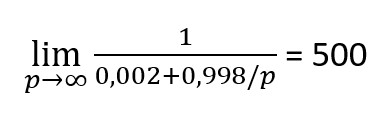

# Game Of Life Report #

| Dati progetto di corso |                                    |
| ---------------------- | ---------------------------------- |
| Studente               | *GIUSEPPE DEL GAUDIO* |
| Stringa MD5            | *d2400086940699c946c996399b11633a* |
| Progetto di corso      | *Game Of Life [1] -d-*             |
| Istanze Ec2            | *t2.small [1] -a-*                 |

## Presentazione della soluzione ##

<br>

Lo scopo del progetto è quello di eseguire Game Of life in parallelo in modo da ottenere un incremento di performance che verranno analizzate in seguito in [analisi delle prestazioni](#analisi-prestazioni).

Per tale scopo è stato utilizzato il protocollo MPI e nello specifico la sua implementazione OpenMPI

Tale soluzione rappresenta la matrice di gioco come un vettore, e distribuisce il lavoro per righe.  

Una volta inizializzata una matrice di partenza ed inseriti un numero di glider scelti dall'utente, il processore root inizializza la matrice *totalGame* e la suddivide per righe che verranno distribuite tra tutti i processori( incluso il root).  

La size locale del problema è data dalla divisione (*nRow/nProc*) * *ncols* e l'eventuale resto viene suddiviso tra tutti i processori.  

Una volta suddivise le righe tra i vari processori, il programma inizia la computazione delle generazioni.  

Per ogni generazione vengono eseguite le seguenti fasi:

- Ricevo riga fantasma superiore e/o inferiore ( non bloccante );

- Invio riga fantasma superiore e/o inferiore ( non bloccante );

- Eseguo la computazione di tutte le righe non interessate da quelle fantasma;

- Attendo ricezione righe fantasma ( bloccante );

- Completo computazione con righe interessate dalle righe fantasma;

- Sincronizzo con altri processori.

Al termine della computazione delle generazioni, tutte le matrice locali vengono riunite nel processore root dando vita alla matrice *totalGame* finale.  

Tale matrice, insieme a quella iniziale, può essere stampata su prompt, su file HTML, oppure su entrambi in base al parametro iniziale.  

Per i dettagli consulatare il paragrafo [Esecuzione](#esecuzione--)

<br>


### Dettagli implementativi ###

<br>

Il processore root dopo aver inizializzato la matrice iniziale, calcola il numero di righe da inviare ad ogni processore, e calcola, se presente, il resto da distribuire tra tutti i processori, aumentando il *count* di uno ad ogni processore e decrementando il resto ad ogni passaggio.

```c
// Numero di righe da processare
local_rows = rows/nproc;  
local_rst = rows % nproc; 

    for(i = 0 ; i<nproc ; i++) // creo vettori displ e count per scatterv
    {
        if(local_rst == 0)
        {
            count[i] = local_rows*cols;
            displ[i] = dist;
            dist+= count[i];
        
        }else{

            count[i] = (local_rows+1)*cols;
            displ[i] = dist;
            dist+= count[i];
            local_rst--; 
        
        }
    } 
} // fine me==0

//Invio num di righe della matrice locale
MPI_Scatter(&count[0] , 1, MPI_INT , &local_num ,1 ,MPI_INT , 0 , MPI_COMM_WORLD );

...

//Invio matrice locale
MPI_Scatterv(&totalGame_0[0], count , displ , MPI_CHAR , &localGame[0] , local_num  , MPI_CHAR , 0 , MPI_COMM_WORLD ); 
```

vengono inoltre inizializzati i vettori *displ* e *count* rispettivamente per il displacement e il sendCount da utilizzare per la distribuzione delle righe con la ***Scatterv***, mentre la ***Scatter*** distribuisce a tutti i processori il numero di righe da elaborare.

Il core di tutta la soluzione è rappresentata dalla "posizione" che ogni processore assume all'interno del *communicator* ***MPI_COMM_WORLD*** e il modo in cui vengono gestite le righe condivise( fantasma ), il comportamento del processore è dato dal rank ovvero: 
- ***rank 0*** : Il processore è il primo, e deve inviare e ricevere solo da *proc+1* avendo solo una riga fantasma condivisa con il proc. successivo; 
  
- ***0<rank<Nproc-1*** : Il processore è centrale, riceve ed invia da *proc+1* e *proc-1* le righe condivise;
  
- ***rank Nproc-1*** : Il processore è l'ultimo deve inviare e ricevere solo da *proc-1* avendo solo una riga fantasma condivisa con il proc. precedente.
 
```c
for( i = 0 ; i<gen ; i++ )
{
    tag = i;  

    if( me == 0 ) // Sono proc 0 No Up - Ricevo down 
    {   
    ...
    }
    
    if (me == nproc-1 && nproc != 1 ) // Sono ultimo proc No down - Ricevo up
    {      
    ...
    }
    
    if( me != nproc-1 && me != 0 ) //Proc centrali inviano e ricevono up - down
    {
    ...
    }

MPI_Barrier(MPI_COMM_WORLD);//Sincronizzo tra genererazioni    
  
memcpy(localGame,newGen,local_num);

}
```

Nel codice si può notare la classificazione dei processori in base al rank, e la sincronizzazione con ***MPI_Barrier*** tra generazioni.  

 ***memcpy*** viene utilizzato per copiare la matrice *newgen* all'interno della matrice *localGame* così da riutilizzarla per la generazione successiva.

Qui di seguito alcuni dettagli implementativi con [esempio di esecuzione processore centrale](#-esecuzione-tipo-di-un-processore-centrale), e [dettagli sulle funzioni fondamentali](#-funzioni-fondamentali-).  

Al termine della computazione sulle generazioni viene eseguita una ***Gatherv*** per ricostruire la matrice finale nel processore root, se richiesto viene eseguita un esecuzione sequenziale e vengono comparati i risultati.  
Al termine del controllo (se richiesto), il processore root stampa in output la matrice finale con la matrice iniziale (se richiesto) con i tempi di esecuzione.

<br>

#### Funzioni fondamentali #### 

---

**neighbour_Count**  
esegue il conteggio dei vicini ancora vivi del target.
```c
int neighbour_Count( char* matrix, int row_target, int col_target, int rows, int cols )
{

    int count = 0;
    
    for(int m = row_target-1 ; m <= row_target+1 ; m++)

        for(int n = col_target-1 ; n <= col_target+1 ; n++ ){
         
            if(m == row_target && n == col_target ) continue;
            if(m < 0 || m >= rows ) continue; // Bordo Superiore - bordo inferiore
            if(n < 0 || n >= cols ) continue; // Bordo sinistro - bordo destro
            if( matrix[n+cols*m] == '-' ) count ++;


        }
    return count;
    
}
```

**makeGame**  
la funzione esegue il gioco sulla matrice data in input e restituisce il risultato sulla matrice newGen passata come puntatore.  

```c
void makeGame( char* game, int cols, int row, int col, int neighb, char* newGen )
{
  
    if( game[col+cols*row] == '-' )
    {
        
        if( neighb < 2 || neighb > 3 ) newGen[col+(cols*row)] = ' '; // morte per starvation
        else newGen[col+cols*row] = '-'; // sopravvive alla generazione successiva


    }else{
        
        if( neighb == 3 ){

            newGen[col+cols*row] = '-'; // nasce 

        } 
        
    }
}
```

**unifyVect**  
la funzione crea una matrice 3 x numCols creata unendo i tre vettori up, down, center utilizzata per unire le righe fantasma

```c
void unifyVect(int cols, char* center, char* up, char* down, char* matrix )
{

    memcpy(matrix ,up ,cols*sizeof(char));
    memcpy(matrix+cols ,center , cols*sizeof(char));
    memcpy(matrix+(cols*2) ,down , cols*sizeof(char));

}
```
---

<br>

#### Esecuzione tipo di un processore centrale ####
---
<br>

L'esecuzione segue i passi descritti nella [prima parte](#presentazione-della-soluzione)

```c
MPI_Isend(&localGame[0] , cols ,MPI_CHAR , me-1 , tag+me-1 , MPI_COMM_WORLD , &req[0] ); //Invio prima riga a proc precedente
MPI_Isend(&localGame[0+cols*(local_rows-1)] , cols ,MPI_CHAR , me+1 , tag+me+1 , MPI_COMM_WORLD , &req[1] ); //Invio ultima riga a proc successivo
MPI_Irecv(&up[0] , cols , MPI_CHAR , me-1 , tag+me , MPI_COMM_WORLD , &req[2] ); //Ricevo riga fantasma up da proc precedente
MPI_Irecv(&down[0] , cols , MPI_CHAR , me+1 , tag+me , MPI_COMM_WORLD , &req[3] );//Ricevo riga fantasma down da proc successivo
```

Vengono inviati ai processori *proc-1* e *proc+1* le righe fantasma, dopodichè il processore si predispone per ricevere le righe fantasma ( non bloccante ). 

```c
if( local_rows == 1 )//Processore ha una sola riga attendo righe fantasma
{
    MPI_Wait(&req[3] , &info); //Attendo ricezione riga down
    MPI_Wait(&req[2] , &info); //Attendo ricezione riga up
    unifyVect(cols, &localGame[0] , up , down , unify);

}else{//Processore ha più righe

    for( int row = 1 ; row < local_rows-1 ; row++ ) // Controllo da seconda a penultima riga della matrice locale
        for( int col = 0 ; col<cols ; col++ )
        {
            neighb = neighbour_Count(&localGame[0], row, col, local_rows, cols);
            makeGame(&localGame[0], cols, row, col, neighb, &newGen[0]);
        }
```

Nel blocco di codice precedente inizia la computazione delle righe possibili senza righe fantasma, se il processore ha una sola riga deve necessariamente attendere le righe fantasma per la computazione.

Se il processore ha più di una riga attende la ricezione della riga down, ed esegue la computazione su ultima riga della sua matrice locale

```c       
MPI_Wait(&req[3] , &info); //Attendo ricezione riga down

unifyVect(cols, &localGame[cols*(local_rows-1)] ,  &localGame[cols*(local_rows-2)] , down , unify); 

for( int col = 0 ; col < cols ; col++ ) // Controllo ultima riga e righe fantasma 
{
    neighb = neighbour_Count(&unify[0], 1 , col , 3, cols);
    makeGame(&localGame[0], cols, local_rows-1, col, neighb, &newGen[0]);
} 
```

Il processore attende riga up ed esegue computazione su prima riga 

```c
MPI_Wait(&req[2] , &info); //Attendo ricezione riga up

unifyVect(cols, &localGame[0], up, &localGame[cols], unify); 

}

for( int col = 0 ; col < cols ; col++ ) // Controllo prima riga e righe fantasma 
{
neighb = neighbour_Count(&unify[0], 1 , col , 3, cols);
makeGame(&localGame[0], cols, 0, col, neighb, &newGen[0]);
}
```

---  

## Correttezza ##

La correttezza della soluzione viene valutata eseguendo la computazione in seriale con il parametro *-c*, e se le due matrici finali corrispondono viene restituito un *Ok*, altrimenti viene restituito l'indirizzo dell'elemento che non corrisponde.

## Analisi prestazioni ##

I tempi sono stati registrati prendendo il tempo di start subito dopo la distribuzione delle righe e lo stop subito dopo il termine della computazione delle generazioni richieste, successivamente viene effettuata una media dei tempi ottenuti tra tutti i processori con una ***Reduce***
```c
//Invio matrice locale
MPI_Scatterv(&totalGame_0[0], count , displ , MPI_CHAR , &localGame[0] , local_num  , MPI_CHAR , 0 , MPI_COMM_WORLD ); 

startTime = MPI_Wtime(); // Prendo tempo iniziale 

for( i = 0 ; i<gen ; i++ )
{
    //computazione generazioni
}

endTime = MPI_Wtime(); // Prendo tempo finale

MPI_Gatherv(&localGame[0],local_num , MPI_CHAR , &totalGame_0[0], count, displ , MPI_CHAR , 0 , MPI_COMM_WORLD);
```
Sono state valutate le performance sia in termini di weak scalability sia in termini di strong scalability.  
Tutti i test sono stati valutati per 100 generazioni e con l'inserimento di 150 strutture, il cluster è composto in totale da 8 macchine ognuna single core ( t2.small ), le macchine sono state istanziate nella region *US-East1*.

<br>

### Strong scalability (Amdhal law) ###

<br>

La strong scalability è dominata dalla legge di amdhal, essa pone un limite superiore allo speedup.

<br>

### ***Speedup = 1/ ( s + p/n )  = T(1,size)/ T(n ,size)*** ###

<br>

Di seguito i risultati ottenuti delle misurazioni ottenute variando solamente il numero di processori.

|           | Sequenziale   | P2             |      |      | P3             |      |      | P4             |      |      | P5             |      |      | P6             |      |      | P7             |      |      | P8             |      |      |
|-----------|---------------|----------------|------|------|----------------|------|------|----------------|------|------|----------------|------|------|----------------|------|------|----------------|------|------|----------------|------|------|
| N         | tempo AVG(s) | tempo AVG (s) | Sp   | Ep   | tempo AVG (s) | Sp   | Ep   | tempo AVG (s) | Sp   | Ep   | tempo AVG (s) | Sp   | Ep   | tempo AVG (s) | Sp   | Ep   | tempo AVG (ms) | Sp   | Ep   | tempo AVG (ms) | Sp   | Ep   |
| 1000*1000 | 4,6527        | 2,3780         | 1,96 | 0,98 | 1,6423         | 2,83 | 0,94 | 1,2474         | 3,73 | 0,93 | 1,2458         | 3,73 | 0,75 | 0,8944         | 5,20 | 0,87 | 0,7792         | 5,97 | 0,85 | 0,7138         | 6,52 | 0,81 |
| 2000*2000 | 18,7207       | 9,4240         | 1,99 | 0,99 | 6,3271         | 2,96 | 0,99 | 4,7396         | 3,95 | 0,99 | 3,8570         | 4,85 | 0,97 | 3,2305         | 5,80 | 0,97 | 2,8046         | 6,68 | 0,95 | 2,4671         | 7,59 | 0,95 |
| 4000*4000 | 74,7726       | 37,6351        | 1,99 | 0,99 | 24,9206        | 3,00 | 1,00 | 19,1709        | 3,90 | 0,98 | 15,3578        | 4,87 | 0,97 | 12,4760        | 5,99 | 1,00 | 10,8987        | 6,86 | 0,98 | 9,7161         | 7,70 | 0,96 |
| 8000*8000 | 298,9104      | 150,2495       | 1,99 | 0,99 | 100,7580       | 2,97 | 0,99 | 77,5671        | 3,85 | 0,96 | 60,1851        | 4,97 | 0,99 | 50,5764        | 5,91 | 0,99 | 43,5438        | 6,86 | 0,98 | 37,9946        | 7,87 | 0,98 |

<br>

Applicando la legge sopra indicata sono state calcolate le percentuali di programma eseguito in modo sequenziale e parallelo al variare dei processori e della size del problema.  

<br>

| Amdahl | 1000*1000 |      | 2000*2000 |      | 4000*4000 |      | 8000*8000 |      |
|--------|-----------|------|-----------|------|-----------|------|-----------|------|
|        | P         | S    | P         | S    | P         | S    | P         | S    |
| P2     | 97,8%     | 2,2% | 99,3%     | 0,7% | 99,3%     | 0,7% | 99,5%     | 0,5% |
| P3     | 97,8%     | 2,2% | 99,3%     | 0,7% | 100,0%    | 0,0% | 99,4%     | 0,6% |
| P4     | 97,6%     | 2,4% | 99,6%     | 0,4% | 99,1%     | 0,9% | 98,7%     | 1,3% |
| P5     | 91,5%     | 8,5% | 99,2%     | 0,8% | 99,3%     | 0,7% | 99,8%     | 0,2% |
| P6     | 96,9%     | 3,1% | 99,3%     | 0,7% | 100,0%    | 0,0% | 99,7%     | 0,3% |
| P7     | 97,1%     | 2,9% | 99,2%     | 0,8% | 99,7%     | 0,3% | 99,7%     | 0,3% |
| P8     | 96,8%     | 3,2% | 99,2%     | 0,8% | 99,4%     | 0,6% | 99,76%    | 0,2% |

Di seguito anche i grafici di speedup ed efficienza

<br>


<br>


<br>

#### Valutazioni scalabilità forte ####  

I risultati ottenuti valutano il comportamento dell'algoritmo in funzione dell'aumento del numero di processori, lasciando inalterato il carico.  

Si possono notare dei valori molto vicini ai risultati ideali avendo speedup alti e efficenza prossima ad uno nella quasi totalità dei casi, sono presenti dei valori anomali come nel caso ***P5 con size 1000\*1000*** con valori bassi dovuti probabilmente ad un ritardo nella rete, oppure un ritardo dovuto ad uno scheduler di uno o più processori, successivamente con 6 processori e stesso carico i valori ottenuti sono tornati nella norma.  

Con carichi bassi ***1000\*1000*** la tendenza della curva di speedup sembra assestarsi, questo è da ritenersi normale dato un basso carico e un aumento dell'overhead di comunicazione dovuto all'incremento dei processori.  

E' da considerarsi inoltre che le Amdhal non tiene conto dell' overhead, a questo è da imputarsi un decremento dello speedup rispetto al caso ideale.

Le percentuali di codice sequenziale e codice parallelo sono da ritenersi in target con i risultati sperati, eccetto i casi limite di cui sopra, infatti la percentuale di codice sequenziale ottenuta, mediamente non supera il 2% e questo secondo Amdhal limiterebbe lo speedup a 500.  



<br>

### Weak scalability (Gustafson law) ###

<br>

La weak scalability è dominata dalla legge di Gustafson, essa mette in relazione la dimensione del problema con il numero di processori, infatti lo speedup ottenuto è detto anche scaled-speedup.  


<br>

### ***Speedup scalato = s + p x N = N( T(1,size) ) / T( N , N * size )*** ###

<br>

Di seguito i risultati ottenuti variando la dimensione del problema in funzione del numero di processori.  

| Scalabilità debole |           |           |           |           |
|:------------------:|:---------:|:---------:|:---------:|:---------:|
|                    | *1000\*1000* | *2000\*1000* | *4000\*1000* | *8000\*1000* |
| Tempo(s)           | 4,65      | 4,68      | 5,02      | 6,00      |
|            Speedup | 1         | 1,99      | 3,71      | 6,20      |
|         Efficienza | 1         | 0,995     | 0,927     | 0,775     |
|                    |           |           |           |           |
|                    | *1000\*1000* | *1000\*2000* | *1000\*4000* | *1000\*8000* |
| Tempo(s)           | 4,65      | 4,74      | 5,32      | 7,72      |
|            Speedup | 1         | 1,96      | 3,50      | 4,82      |
|         Efficienza | 1         | 0,982     | 0,875     | 0,603     |
|                    |           |           |           |           |
|          SP.Ideale | 1         | 2         | 4         | 8         |
| Ef. Ideale         | 1         | 1         | 1         | 1         |
|                    |           |           |           |           |
|                    | *P1*        | *P2*        | *P4*        | *P8*        |

<br>

Applicando la legge sopra indicata sono state calcolate le percentuali di programma eseguito in modo sequenziale e parallelo al variare dei processori e della size del problema.  

<br>

| Gustafson |       |           |       |           |       |
|-----------|-------|-----------|-------|-----------|-------|
| *2000\*1000* |       | *4000\*1000* |       | *8000\*1000* |       |
| S         | P     | S         | P     | S         | P     |
| 1,0%      | 99,0% | 9,7%      | 90,3% | 25,7%     | 74,3% |
|           |       |           |       |           |       |
| *1000\*2000* |       | *1000\*4000* |       | *1000\*8000* |       |
| S         | P     | S         | P     | S         | P     |
| 3,7%      | 96,3% | 16,7%     | 83,3% | 45,4%     | 54,6% |
|           |       |           |       |           |       |
| *P2*         |       | *P4*         |       | *P8*         |       |

Di seguito anche i grafici di speedup ed efficienza

<br>


<br>


<br>

#### Valutazioni scalabilità debole ####

I risultati ottenuti valutano il comportamento dell'algoritmo in funzione dell'aumento del numero di processori, e scalando con esso il carico dei processori.  

Il carico da eseguire complessivo è stato moltiplicato per il numero di processori che esegue, scalando in una sola dimensione sia per righe sia per colonne.   

In entrambi i casi come da grafici sopra proposti la parte sequenziale aumenta all'aumentare dei processori, nel caso di scalabilita su righe l'aumento è meno drastico poichè avendo per ogni processore la stessa size(*1000\*1000*) si aggiunge solo l'overhead dovuto a sincronizzazione e comunicazione, nel caso della scalabilità su colonne, le righe per ogni processore diminuiscono all'aumentare dei processori, ed aumentano il numero di colonne.  

In entrambi i casi le size del problema rimangono invariate.  
 
Si può affermare quindi che il programma in analisi a causa dell'overhead non scala in modo ottimale a partire da 4 processori.

Da notare che lo speedup, scalando entrambe le dimensioni con il cluster diponibile con size *2000\*2000* e *P4* ***SS= (4,65\*4) / 4,73 = 3,92*** molto vicino allo speedup ideale, non è stato possibile verificare se la tendenza positiva possa continuare con *4000\*4000* e *16P*.  


## Esecuzione  ## 

Per il testing si è utilizzato il docker disponibile [qui](https://hub.docker.com/r/spagnuolocarmine/docker-mpi)

Per la build del docker : 

```docker
docker run -it --name mpi --cap-add=SYS_PTRACE --mount type=bind,source="$(pwd)"/[percorso da montare],target=/mpi  spagnuolocarmine/docker-mpi
```

Per la compilazione del sorgente eseguire il comando :  
```
mpicc game_of_life.c -o game_of_life
```

Per l'esecuzione :
```
mpirun --allow-run-as-root  -np [nProc] game_of_life -rows [nRighe] -cols [nColonne] -gen [nGen] -n [nStrutt] *[Output] *[Altro]
```
Esempio: 
```
mpirun --allow-run-as-root  -np 4 game_of_life -rows 20 -cols 20 -gen 100 -n 15 -a -c
```

**Parametri obbligatori :**

- [nProc] : indica il numero di processori sulla quale eseguire il programma;
- [nRighe] : indica il numero di righe della matrice; 
- [nColonne] : indica il numero di colonne della matrice;
- [nGen] : indica il numero di generazioni;
- [nStrutt] : indica il numero di strutture da inserire (glider).

Se non inseriti ulteriori [parametri](#parametri) viene stampato solo il tempo di esecuzione del programma parallelo.

Per l'avvio su cluster è necessario specificare un *hfile* da inserire come parametro, dove vengono specificati gli ip e gli slot di computazione disponibili per il nodo.

### Parametri ###

È possibile aggiungere dei flag facoltativi per decidere l'output o altri comportamenti, di seguito i flag: 

**Output :**

- ***-p*** : stampa su prompt la matrice iniziale e la matrice finale con i tempi ottenuti; 
- ***-h*** : stampa su un file in HTML la matrice iniziale e finale con i tempi di esecuzione;
- ***-a*** : i risultati ottenuti vengono stampati su prompt e su file HTML.

**Altro :**

- ***-all*** : vengono stampate su console lo stato di avanzamento delle generazioni;
- ***-c*** : viene eseguito un check sequenziale dando in output il tempo di esecuzione sequenziale e confrontando le due matrici di output.

## Conclusioni ##

Come analizzato precedentemente nei paragrafi sulla scalabilità [debole](#valutazioni-scalabilità-debole) e sulla scalabilità [forte](#valutazioni-scalabilità-forte), il programma presentato scala molto bene in termini di scalabilità forte, ed ha discreti risultati in termini di scalabilità debole.  

Resta comunque come detto in precedenza da testare su un cluster di maggiore entità(16 processori) la scalabilità su entrambe le dimensioni della matrice, per verificare il trend positivo dimostrato su 4 processori.

Il programma presentato durante la computazione delle generazioni mostra una singola sincronizzazione al termine di ogni generazione, non dovrebbe presentare un particolare problema, poichè essendo un cluster omogeneo ed avendo ogni processore la stessa size complessiva, ogni processore dovrebbe terminare la propria generazione quasi in contemporanea (a meno di comportamenti dello scheduler di sistema inaspettati).

Il bilanciamento dei dati viene eseguito correttamente, lasciando per ogni processore la stessa size della matrice locale, avendo solo piccole differenze atte a gestire il resto eventuale.

Tutti i processori del cluster partecipano alla computazione incluso il root.
